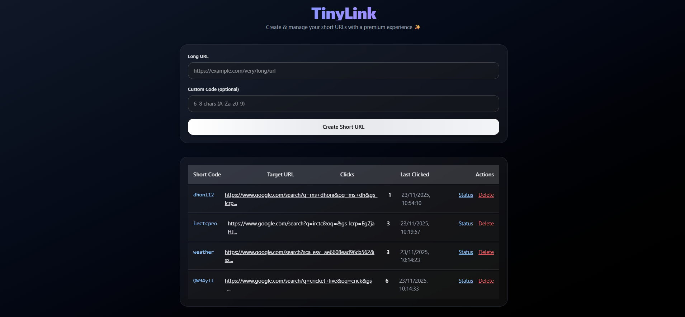
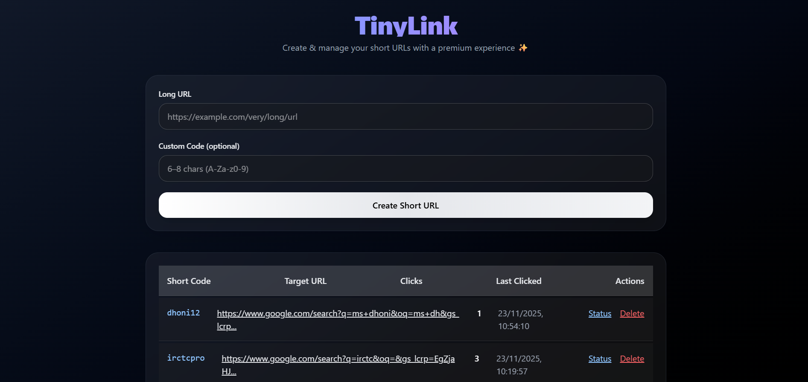
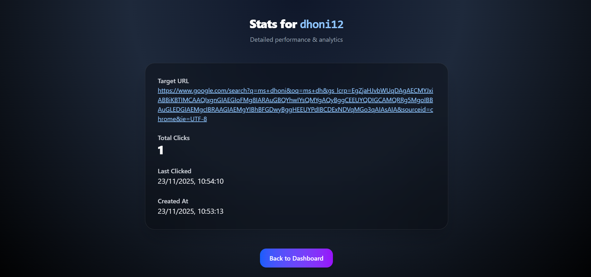
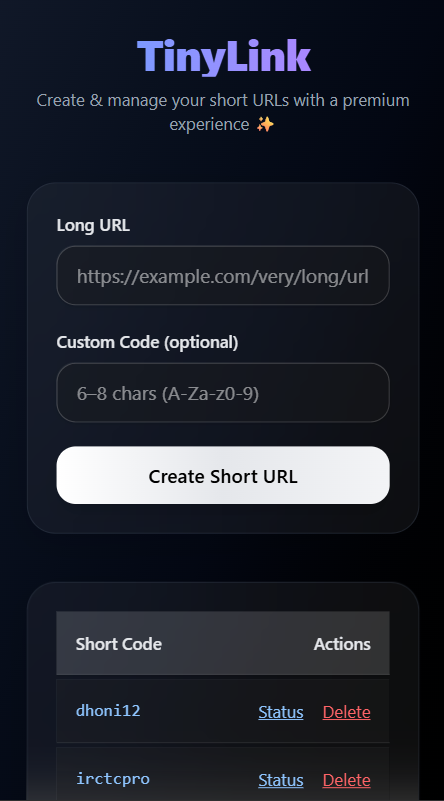

# TinyLink 🚀
TinyLink is a modern, sleek URL shortener built with **Next.js**, **React**, and **Prisma**. It allows you to create, manage, and track short URLs with real-time analytics for clicks like things.

---
## Features ✨
- Create short links with auto-generated or custom codes.  
- View all links in a dashboard with real-time click count updates.  
- Detailed statistics for each link:
  - Target URL  
  - Total clicks  
  - Last clicked timestamp  
  - Created at timestamp  
- Delete links directly from the dashboard.  
- Clean, responsive UI with light/dark mode support.  
- Notifications for actions (success/error) using `react-hot-toast`.

---

## Screenshots 🖼️

---

## Tech Stack 🛠️
- **Frontend:** Next.js (App Router), React, Tailwind CSS  
- **Backend:** Next.js API routes, Prisma ORM  
- **Database:** SQLite/PostgreSQL (via Prisma)  
- **Utilities:** nanoid (for generating unique codes), react-hot-toast (notifications)

---

## Installation & Setup ⚡
1. **Clone the repository**
2. **Install Node Modules and dependencies**
3. **Use 'npm run dev' command to run the project**
